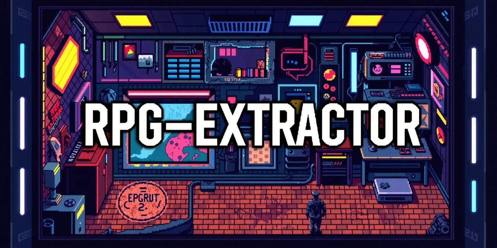
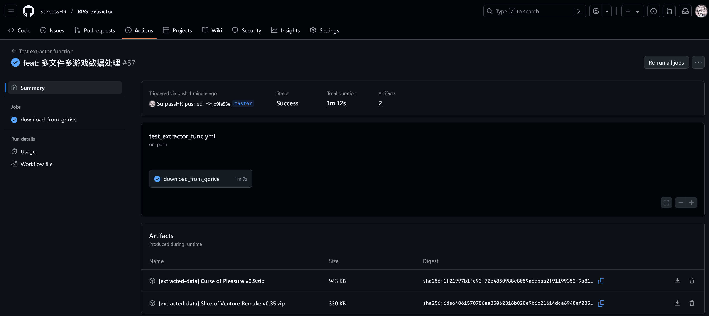

<div align="center">
    
</div>

## Description

This is a tool for extracting RPG(Role Playing Game) related data that has `.rxdata`, `.rvdata`, `.json` and `.js` ext.
The structure is extensible as you can add your 'processer' to src/processers.

## Usage

### 1. Config file

```bash
bash ./init_dev_env.sh # prepare environment for script to run
# edit config.json to set the game data you want to extract from
python ./run.py
```

### 2. Command line arguments

```bash
bash ./init_dev_env.sh # prepare environment for script to run
python ./run.py --dataFolder <path_of_folder_contains_data_file> --outputFolder <destination_the_extraction_files_will_put> --title [just_write_your_games_title] --format
```

> Note: Command line arguments' priority is higher than config file.

### 3. GUI

Under construction

## Get process result online

Go to `Actions - Test extractor function`, click latest workflow and get extraction file.



## Supported game data file type

- `Rxdata`

- `Rvdata`

- `Json`

- Plugins with `.js` ext

## Todo

- [x] Multi-threaded file-writing

- [x] Decode Scripts.rxdata

- [x] Merge my another format module into this

- [x] Command line

- [x] Make reader module more extensible to support other format like json

- [x] Auto guessing the main file type under the set path

- [x] Support cli arguments, see `argParser.py`

- [x] Github actions to generate artifacts of extraction files

- [ ] GUI

- [ ] Parse Scripts.rxdata

- [ ] Recognizing illegal words and phrases
